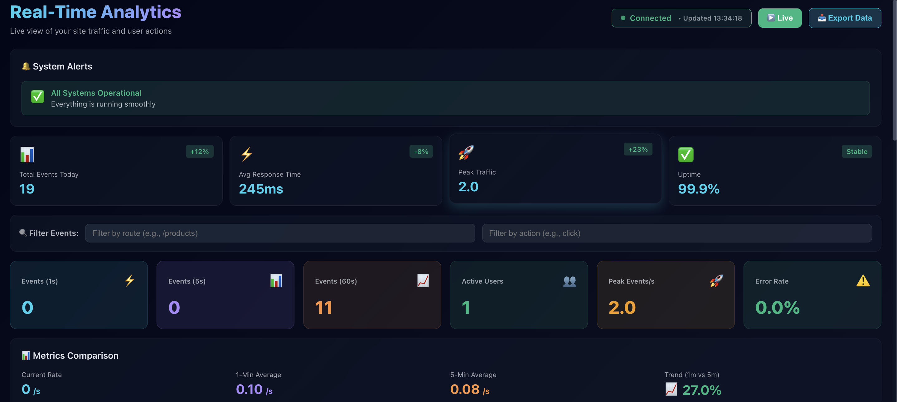
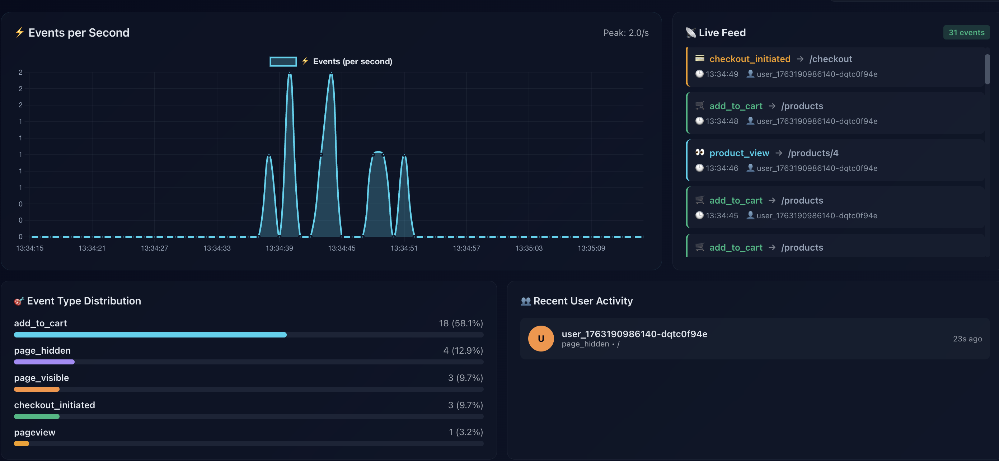
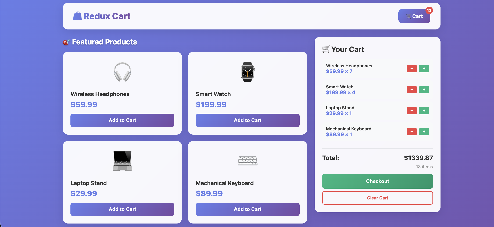

---

## 🧠 Backend (Event Ingestion System)

A scalable backend service responsible for **real-time event ingestion and processing**.

### 🔹 Tech Stack
- Node.js
- Express
- MongoDB
- Socket.IO

### 🔹 Responsibilities
- Accepts real-time user events (page views, cart actions, checkout)
- Validates incoming payloads
- Stores events in MongoDB
- Emits live updates via WebSockets

---

## 📊 Analytics Dashboard (Frontend)

A real-time analytics dashboard that visualizes **live traffic, events, and system health**.

### 🔹 Tech Stack
- React (Vite)
- JavaScript
- Socket.IO Client
- Charting libraries

### 🔹 Features
- Live WebSocket connection status
- Events-per-second visualization
- Real-time charts and metrics
- System alerts and uptime monitoring
- Clean, responsive dark-themed UI

📸 **Dashboard Overview**  


📸 **Live Events & Analytics View**  


---

## 🛒 Redux Cart (State Management Demo)

A standalone frontend project demonstrating **Redux Toolkit** for global state management.

### 🔹 Features
- Add / remove products from cart
- Quantity increment and decrement
- Cart total calculation using Redux selectors
- Clean, scalable Redux architecture

📸 **Redux Cart Preview**  


---

## ⚙️ Setup Instructions

### 1️⃣ Clone the Repository
```bash
git clone https://github.com/MrKhan092/Real-Time-Analytics-Dashboard.git
cd Real-Time-Analytics-Dashboard
